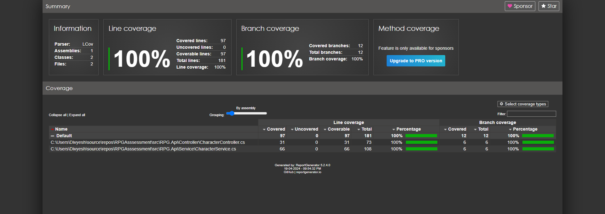

# RPGAsssessment

### To build the project

`dotnet build ./RPG.sln`

### To generate TestResults

`dotnet test RPG.sln /p:CollectCoverage=true /p:CoverletOutputFormat=lcov /p:CoverletOutput=../../TestResults/lcov.info --logger "trx;LogFileName=test-results.trx" --results-directory "TestResults"`

### To generate code coverage reports in HTML

`reportgenerator -reports:TestResults/**/lcov.info -targetdir:TestResults/HtmlReport`

